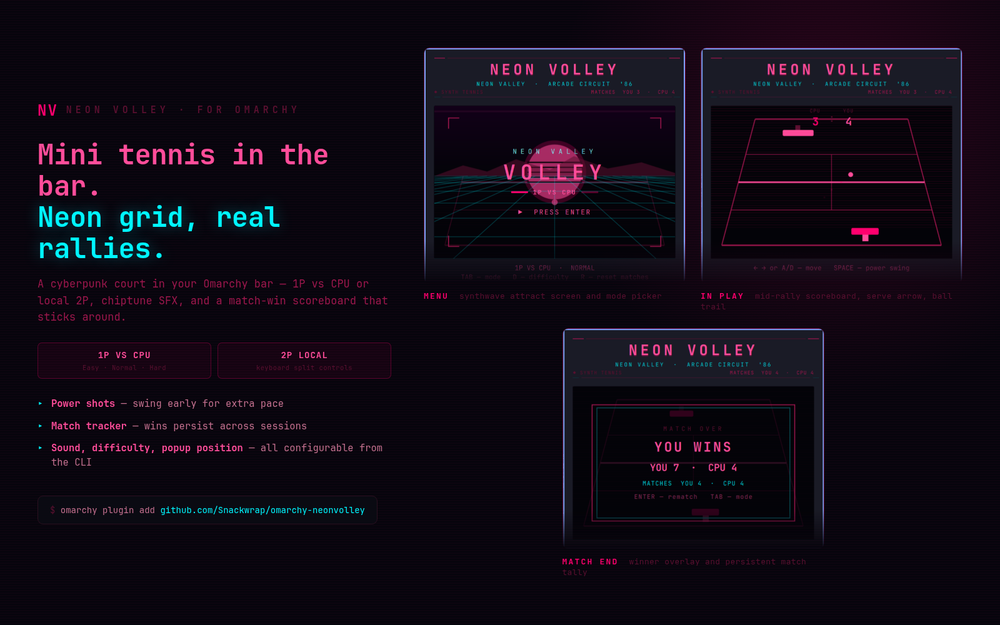

# Neon Volley — Omarchy bar plugin



A cyberpunk mini tennis game for the [Omarchy](https://omarchy.org) bar. Neon-on-black grid court, scanlines, chiptune SFX, **1P vs CPU** or **local 2P**, and a persistent match-win scoreboard.

Click the **NV** pill to open the court. Middle-click resets to the menu.

## Controls

### Menu
| Input | Action |
|-------|--------|
| **TAB** | Switch 1P vs CPU / 2P local |
| **D** | Cycle CPU difficulty (1P only) |
| **R** | Reset match-win tracker |
| **ENTER** | Start match |
| **ESC** | Close |

### 1P vs CPU
| Input | Action |
|-------|--------|
| **← →** or **A D** | Move (near paddle) |
| **SPACE** | Swing (early = power shot) |
| **ENTER** | Rematch (after game over) |

### 2P local
| Player | Move | Swing |
|--------|------|-------|
| **P1** (near / magenta) | **← →** | **SPACE** |
| **P2** (far / cyan) | **A D** | **ENTER** |

## Scoreboard

- **Points** — shown on the court during a match (first to 7 by default).
- **Matches** — win tracker in the masthead (`MATCHES YOU · CPU` or `MATCHES P1 · P2`), persisted to `~/.local/state/omarchy/plugins/com.leafbox.neonvolley/scores.json`.

## Requirements

- Omarchy **Quattro (v4)** with `omarchy-shell`
- `paplay` on `PATH` for sound (optional)

## Install

```bash
omarchy plugin add https://github.com/Snackwrap/omarchy-neonvolley.git --enable
omarchy bar move com.leafbox.neonvolley right
```

## Local development

```bash
./deploy-local.sh
omarchy plugin enable com.leafbox.neonvolley right
omarchy restart shell
```

Reload the shell after each edit — `rescanPlugins` alone will not pick up changed QML.

To regenerate the marketplace card:

```bash
./tools/capture-preview.sh    # needs a running Hyprland session + the plugin enabled
./tools/build-preview.sh      # composes preview.png from assets/tabs/
```

## Settings

Omarchy does not yet expose a settings UI for bar widgets — configure via the CLI, then restart the shell:

```bash
omarchy bar set com.leafbox.neonvolley sound false
omarchy bar set com.leafbox.neonvolley popupPosition center   # or icon (default)
omarchy bar set com.leafbox.neonvolley mode two               # default to 2P
omarchy bar set com.leafbox.neonvolley difficulty hard
omarchy bar set com.leafbox.neonvolley matchPoints 11
omarchy restart shell
```

| Setting | Key | Default | Options |
|---------|-----|---------|---------|
| Sound effects | `sound` | `true` | boolean |
| Default mode | `mode` | `cpu` | `cpu`, `two` |
| CPU difficulty | `difficulty` | `normal` | `easy`, `normal`, `hard` |
| Points to win | `matchPoints` | `7` | 3–21 |
| Popup position | `popupPosition` | `icon` | `icon`, `center` |

## Features

- **CPU difficulty** — Easy / Normal / Hard
- **Match intro** — READY / FIGHT flash + jingle on start
- **Game-over screen** — winner, score, updated match tally
- **Serve indicator** — arrow at the net shows who is serving
- **Power shot** — swing in the first ~70ms of the stroke for extra pace
- **Bar pill pulse** — NV pill breathes during active matches

## Uninstall

```bash
omarchy plugin disable com.leafbox.neonvolley
omarchy plugin remove com.leafbox.neonvolley
omarchy restart shell
```

## License

MIT
